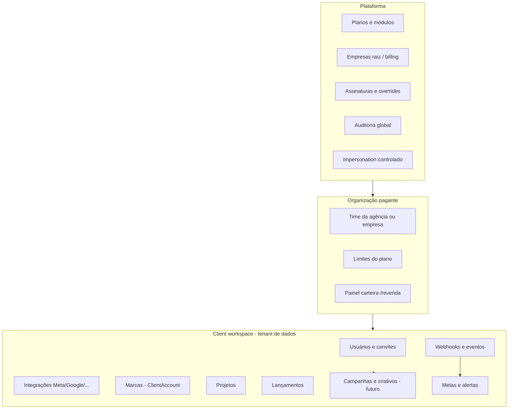

# Ativa Dash — Arquitetura SaaS premium (produto, dados, segurança)

Documento de referência para alinhar produto, backend, frontend e operações.  
**Estado atual (repo):** multi-tenant via `Organization` hierárquica (`parentOrganizationId`), planos `Plan` + `Subscription`, filhos com `ResellerOrgKind` (`AGENCY` | `CLIENT`), `Membership.role` string, `ClientAccount` / `Project` / `Launch`, `Integration`, `MarketingSettings`, `ResellerAuditLog`, `MetricsSnapshot`.  
**Direção:** reforçar isolamento, RBAC com escopo fino, hub de webhooks, materialização de métricas e operações de mídia sem substituir a stack.

---

## 1. Mapa de domínio



| Contexto | Responsabilidade | Onde vive hoje | Onde deve evoluir |
|----------|------------------|----------------|-------------------|
| **Plataforma** | Catálogo, billing global, suporte, auditoria, criação de tenants | `PlatformPage`, rotas `/platform/*`, `platform.service` | Módulos explícitos, impersonation auditável, health global |
| **Agência / empresa direta** | Contrata plano, cria workspaces filhos, governa carteira | `Organization` sem pai ou matriz revenda | Papel `agency_owner` explícito, limites `maxChildOrganizations` |
| **Client workspace** | Dados isolados do cliente da agência | `Organization` filha `resellerOrgKind=CLIENT` | Tratar semanticamente como “Workspace”; UI consistente |
| **Marca / unidade** | Agrupamento *dentro* do workspace (não é cliente da agência no sentido comercial) | `ClientAccount` | Enriquecer com status, owner, segmento, KPIs agregados |
| **Projeto / lançamento** | Janela operacional e filtros | `Project`, `Launch` | Metas, pacing, vínculo com campanhas e filtros salvos |
| **Mídia paga** | Leitura e, depois, escrita na API Meta/Google | Rotas marketing + integrações | Entidades `*AdAccount`, snapshots diários, RBAC por conta |
| **Webhooks** | Entrada de eventos normalizados | Ausente como domínio de primeira classe | `WebhookEndpoint`, `WebhookEvent`, dedupe, replay |
| **Inteligência** | Alertas, insights, recomendações | `MarketingSettings`, insights no dashboard | Regras versionadas, ocorrências, histórico |

**Regra de negócio crítica:** agência não cria outra agência como filha pagante encadeada; filhos permitidos são **workspaces de cliente** (`CLIENT`). Validação deve existir no **serviço de criação de organização**, não só na UI.

---

## 2. Modelo de tenancy

### 2.1 Três camadas conceituais (mapeamento Prisma)

| Camada | Conceito | Modelo atual | ID de isolamento principal |
|--------|----------|--------------|----------------------------|
| L0 | Plataforma | Sem linha dedicada; admins por `User` + env `PLATFORM_ADMIN_EMAILS` | Ações globais auditadas |
| L1 | **Billing tenant** | `Organization` com `parentOrganizationId = null` ou matriz revenda que paga | `organizationId` da matriz |
| L2 | **Workspace operacional** | `Organization` filha com `resellerOrgKind = CLIENT` (ou org “direta” única sem filhos) | `organizationId` do workspace |

**Empresa final sem agência:** um único `Organization` (L1 = L2): não há filhos; `resellerOrgKind` pode ser `null`.

**Isolamento de dados:** toda query mutável deve filtrar por `organizationId` do **workspace ativo no contexto da requisição** (JWT / sessão). Para usuários da matriz operando em cliente, o contexto deve ser **explicitamente** o `organizationId` do workspace escolhido (barra de contexto), nunca “vazar” dados de outro filho.

### 2.2 Contexto de requisição (padrão desejado)

```ts
// Conceito — implementar middleware + tipo
type RequestContext = {
  userId: string;
  /** Organização cujo dado está sendo lido/escrito */
  activeOrganizationId: string;
  /** Se usuário age em nome da matriz sobre um filho */
  matrixOrganizationId: string | null;
  platformAdmin: boolean;
};
```

### 2.3 Hierarquia permitida (árvore)

```
Plataforma
└── Org matriz (AGENCY) [billing]
    ├── Workspace cliente A [CLIENT]
    ├── Workspace cliente B [CLIENT]
    └── …
```

```
Plataforma
└── Org empresa direta [sem kind ou tratada como workspace único]
```

**Proibido:** `CLIENT` criar sub-`CLIENT` que funcione como segunda agência (nested resale). Se no futuro existir “sub-conta”, deve ser `ClientAccount` ou projeto, não nova `Organization` pagante.

---

## 3. Modelo de permissões

### 3.1 Princípios

1. **Papel base** (`Membership.role`) define teto de capacidades.
2. **Grants** restringem por escopo (workspace já resolvido pelo contexto; para matriz, grants podem listar quais filhos o usuário pode acessar).
3. **Permissões atômicas** (capabilities) para ações (ex.: `media.meta.budget.edit`, `media.meta.campaign.create`).
4. Avaliação: `platformAdmin` OU (`role` satisfaz) E (todos os grants aplicáveis permitem) E (módulo do plano habilitado).

### 3.2 Perfis sugeridos (enum ou tabela de referência)

**Plataforma:** `platform_owner`, `platform_admin`, `platform_support`  
**Agência (matriz):** `agency_owner`, `agency_admin`, `agency_finance`, `agency_ops`  
**Workspace:** `workspace_owner`, `workspace_admin`, `media_meta_manager`, `media_google_manager`, `performance_analyst`, `report_viewer`, `sales_viewer`

Mapeamento inicial a partir do código existente: `Membership.role` hoje é string livre — **migrar** para valores canônicos + tabela `RoleDefinition` opcional (descrição, capabilities default).

### 3.3 Escopos (grants)

| Dimensão | Valores | Armazenamento sugerido |
|----------|---------|-------------------------|
| Canais | `META`, `GOOGLE`, `WEBHOOKS`, `REVENUE`, `REPORTS` | JSON em `WorkspaceAccessGrant.allowedChannels[]` ou linhas normalizadas |
| Contas Meta | `adAccountId` (string da API) | `AssetAccessGrant` tipo `META_AD_ACCOUNT` |
| Contas Google | `customerId` | idem `GOOGLE_ADS_ACCOUNT` |
| Projetos | `projectId` | `allowedProjectIds[]` ou tabela N:N |
| Lançamentos | `launchId` | idem |

**Casos obrigatórios (matriz de teste):**

- Gestor X: só Meta, só cliente A, só contas `{act_1}`.
- Gestor Y: só Google, cliente A.
- Gestor Z: Meta + Google, cliente B.
- Dono agência: sem grants restritivos = full dentro da matriz + todos os filhos.
- Cliente final no workspace: `report_viewer` + grants mínimos.
- Superadmin: bypass controlado + auditoria obrigatória.

### 3.4 Auditoria sensível

Eventos mínimos: impersonation start/end, mudança de papel, reset senha, conectar/desconectar integração, alteração de orçamento em campanha, exclusão/arquivamento workspace, mudança de plano.  
Hoje: `ResellerAuditLog` (matriz). **Estender** para `AuditLog` genérico com `organizationId`, `actorUserId`, `action`, `entityType`, `entityId`, `metadata`, `ip`, `userAgent` (opcional).

---

## 4. Lista de entidades

### 4.1 Já existentes (manter e evoluir)

- `User`, `RefreshToken`, `Membership`, `Invitation`
- `Organization`, `Plan`, `Subscription`, `SubscriptionLimitsOverride`
- `ClientAccount`, `Project`, `Launch`
- `Integration`, `MarketingSettings`, `Goal`, `Dashboard`, `DashboardWidget`
- `MetricsSnapshot`, `ResellerAuditLog`

### 4.2 Novas / a introduzir (priorizadas)

| Entidade | Função |
|----------|--------|
| `WorkspaceAccessGrant` | userId + matrixOrgId ou workspaceId + canais + flags |
| `AssetAccessGrant` | userId + organizationId + tipo de ativo + externalId |
| `ProjectAccessGrant` / `LaunchAccessGrant` | opcional se não usar JSON nos grants |
| `WebhookEndpoint` | path, secret hash, workspaceId, status |
| `WebhookEvent` | eventId dedupe, payload, status, erro, replay |
| `WebhookDelivery` | tentativas, resposta HTTP (opcional) |
| `NormalizedInboundEvent` | modelo canônico lead/checkout/compra (campos que você listou) |
| `CampaignSnapshotDaily` / `AdSnapshotDaily` | agregação por dia (workspace + ids externos) |
| `SavedView` | filtros persistidos por usuário/workspace |
| `AlertRule` / `AlertOccurrence` | regras além do MarketingSettings simples |
| `ModuleEntitlement` | opcional: normalizar `Plan.features` |
| `UserSession` | opcional: revogar sessões |

### 4.3 Entidades “Meta/Google” (Fase operação)

Primeiro como **referência** ligada a `Integration` + cache; depois tabelas próprias se necessário:

- `MetaAdAccount` (workspaceId, accountId, name, status)
- `GoogleAdsAccount` (idem)

Evitar duplicar fonte da verdade: integração OAuth continua em `Integration`; contas como catálogo para RBAC e UI.

---

## 5. Estrutura de rotas (alvo produto)

Rotas atuais no `App.tsx` devem convergir para esta semântica:

| Rota | Papel | Notas |
|------|-------|------|
| `/dashboard` | Home executiva do **workspace ativo** | Skeletons por bloco; stale-while-revalidate |
| `/marketing` | Cockpit operacional | Barra de contexto: workspace (se matriz), projeto, lançamento, período, canal, temperatura |
| `/marketing/captacao` | Aquisição | Meta vs Google, rankings |
| `/marketing/conversao` | Funil e qualidade | Webhooks quando existirem |
| `/marketing/receita` | Receita e ROAS | Estados: zerado / indisponível / tracking incompleto |
| `/marketing/integracoes` | Hub | Múltiplas contas; webhooks; pagamentos (fases) |
| `/marketing/configuracoes` | Metas e alertas avançados | Evoluir `MarketingSettings` + regras |
| `/clientes` | **Marcas/unidades** (`ClientAccount`) | Copy e KPIs alinhados ao glossário |
| `/projetos` | Projetos | Cockpit, orçamento, timeline |
| `/lancamentos` | Lançamentos | Wizard, vínculo a campanhas |
| `/usuarios` ou `/equipe` | Equipe do workspace | Convites, papéis, escopos |
| `/configuracoes` | Hub empresa/branding/timezone | Abas conforme spec |
| `/revenda` | **Painel da carteira** (matriz) | Renomear mentalmente para “Carteira”; tabs da spec |
| `/plataforma` | Superadmin | Planos, empresas, assinaturas, auditoria |

**Autenticação:** rotas `/plataforma` e `/revenda` com guards distintos (platform admin vs membership matriz).

---

## 6. Endpoints (grupos)

### 6.1 Contexto e auth

- `GET /me` — usuário, organizações acessíveis, papel, módulos efetivos, workspace ativo sugerido
- `POST /context/workspace` — trocar workspace ativo (cookie/JWT)
- `POST /auth/logout`, refresh já existente

### 6.2 Plataforma (admin)

- CRUD planos, empresas, assinaturas (já parcialmente em `/platform/*`)
- `POST /platform/impersonate` + `DELETE` — com audit trail
- `GET /platform/audit` — paginado

### 6.3 Matriz / revenda

- CRUD child organizations (workspaces cliente)
- `GET /revenda/overview` — KPIs carteira
- `GET/PUT /revenda/users/:id/grants`
- Auditoria estendida

### 6.4 Workspace — marketing

- `GET /marketing/summary` — rápido, para topo do dashboard (separar de detail)
- `GET /marketing/detail` — tabelas, breakdown (paginado)
- `GET /marketing/timeseries`
- Fase Ads: `PATCH /marketing/meta/campaigns/:id` (status, budget, name) — por conta autorizada

### 6.5 Webhooks

- `POST /webhooks/inbound/:workspaceSlug` — HMAC + rate limit
- `GET /webhooks/endpoints` — admin workspace
- `POST /webhooks/endpoints/:id/replay`
- `GET /webhooks/events` — filtros, status

### 6.6 Clientes / projetos / lançamentos

- CRUD REST já implícito; padronizar prefixo `/organizations/:orgId/...` ou header `X-Organization-Id`

---

## 7. Proposta de evolução do schema Prisma

**Estratégia:** migrações **aditivas**; não quebrar tenants existentes.

### 7.1 Ajustes em modelos existentes

- `Membership`: `role` → valores canônicos; opcional `roleVersion Int`
- `Organization`: campo opcional `organizationKind` enum `MATRIX | DIRECT | CLIENT_WORKSPACE` alinhado a `resellerOrgKind` (ou unificar em migração futura)
- `Integration`: preparar `config` JSON tipado ou colunas para `externalAccountIds[]`
- `Plan.features`: documentar chaves de módulo (`marketing`, `webhooks`, `campaign_operations`, …)

### 7.2 Novos modelos (rascunho relacional)

```prisma
enum Channel {
  META
  GOOGLE
  WEBHOOKS
  REVENUE
  REPORTS
}

enum GrantAssetType {
  META_AD_ACCOUNT
  GOOGLE_ADS_CUSTOMER
  WEBHOOK_ENDPOINT
}

model WorkspaceAccessGrant {
  id             String   @id @default(cuid())
  userId         String
  user           User     @relation(fields: [userId], references: [id], onDelete: Cascade)
  organizationId String   // workspace ao qual o grant se aplica
  organization   Organization @relation(fields: [organizationId], references: [id], onDelete: Cascade)
  allowedChannels Channel[] // ou String[] se preferir pragmatismo
  createdAt      DateTime @default(now())
  updatedAt      DateTime @updatedAt

  @@index([userId, organizationId])
}

model AssetAccessGrant {
  id             String   @id @default(cuid())
  userId         String
  organizationId String
  assetType      GrantAssetType
  externalId     String
  createdAt      DateTime @default(now())

  @@unique([userId, organizationId, assetType, externalId])
  @@index([organizationId])
}

model WebhookEndpoint {
  id             String   @id @default(cuid())
  organizationId String
  slug           String   // path público
  secretHash     String
  active         Boolean  @default(true)
  createdAt      DateTime @default(now())
  updatedAt      DateTime @updatedAt

  @@unique([organizationId, slug])
}

model WebhookEvent {
  id             String   @id @default(cuid())
  organizationId String
  eventKey       String   // dedupe com source + external
  sourceType     String
  status         String   // received | processed | failed | dead
  occurredAt     DateTime?
  normalized     Json?
  rawPayload     Json
  errorMessage   String?  @db.Text
  createdAt      DateTime @default(now())

  @@unique([organizationId, eventKey])
  @@index([organizationId, createdAt])
}
```

Campos normalizados (`contactEmail`, `utm_*`, `value`, etc.) podem viver em `normalized Json` até estabilizar, depois colunas para reporting.

### 7.3 Índices críticos para performance

- `(organizationId, date)` em snapshots e eventos
- `(organizationId, campaignExternalId)` quando existir tabela de campanhas
- Partial indexes para `status = 'failed'` em filas de replay

---

## 8. Plano de implementação por fases

### Fase 0 — Fundações (1–2 sprints)

- Documentar glossário no app (cliente da agência = workspace; `/clientes` = marcas).
- Middleware de `activeOrganizationId` consistente em todas as rotas de marketing.
- Endpoint `GET /marketing/summary` (ou agregar payload atual) separado do pesado.
- Dashboard: skeletons por seção + manter último estado (React Query / store).
- Validação backend: impedir hierarquia inválida (agência dentro de agência).

### Fase 1 — RBAC e grants (2–3 sprints)

- Enum/canonização de `Membership.role`.
- Tabelas `WorkspaceAccessGrant` + `AssetAccessGrant`.
- Camada de autorização central (`assertCan(user, capability, { organizationId, assetId })`).
- UI `/usuarios`: exibir e editar escopos (matriz e workspace).
- Auditoria genérica + impersonation.

### Fase 2 — Webhook hub MVP (2–3 sprints)

- `WebhookEndpoint` + assinatura HMAC + ingestão.
- `WebhookEvent` com dedupe (`eventKey`), status, logs admin.
- Mapeamento mínimo → eventos `lead_created`, `purchase_paid` na normalização.
- Expor contagens no funil `/marketing/conversao` quando `source = webhook`.

### Fase 3 — Marketing operacional leitura++ (contínuo)

- Barra de contexto em `/marketing` (projeto, lançamento, canal).
- Tabelas campanha/conjunto/anúncio com filtros salvos (`SavedView`).
- Top campanhas no dashboard a partir de API existente ou snapshot.

### Fase 4 — Escrita Meta (Fase 1 Ads Manager replacement)

- OAuth e escopo por `AssetAccessGrant`.
- Actions: pause/activate, budget, rename, duplicate (por endpoints dedicados + fila opcional).
- Auditoria por alteração.

### Fase 5 — Google parity + automações

- Paridade de leitura/escrita Google onde API permitir.
- Regras de alerta avançadas (`AlertRule`), mute por horário, entrega email (futuro).

---

## 9. Checklist de qualidade (não negociável)

- [ ] Nenhuma rota de negócio confia só no `organizationId` enviado pelo cliente sem checagem de membership + grants.
- [ ] Agência não cria filho `AGENCY` encadeado (validação servidor).
- [ ] Ações sensíveis geram `AuditLog`.
- [ ] Telas críticas não dependem de um único loader global; usar skeleton + stale data.
- [ ] Integrações e webhooks isolados por `organizationId` do workspace.
- [ ] Documentação de módulos do plano alinhada ao que o código enforce.

---

## 10. Próximos passos recomendados no repositório

1. **Pacote técnico executável (sem implementação ainda):** [`docs/arquitetura-final/`](arquitetura-final/00-indice-e-resumo-executivo.md) — schema alvo, RBAC, contrato de APIs, fases, telas, métricas, checklist pré-coding.
2. Congelar este documento como visão de produto; detalhes de implementação vivem em `arquitetura-final/`.
3. Abrir issues/tarefas por fase somente após o checklist em `07-checklist-pre-coding.md` estar verde.
4. Primeira entrega código: **Fase 1** do plano em `04-plano-fases-implementacao.md` (tenancy + contexto + grants + auditoria mínima).

---

*Última atualização: documento gerado para alinhar visão de produto com o código existente em `backend/prisma/schema.prisma` e rotas atuais do frontend.*
